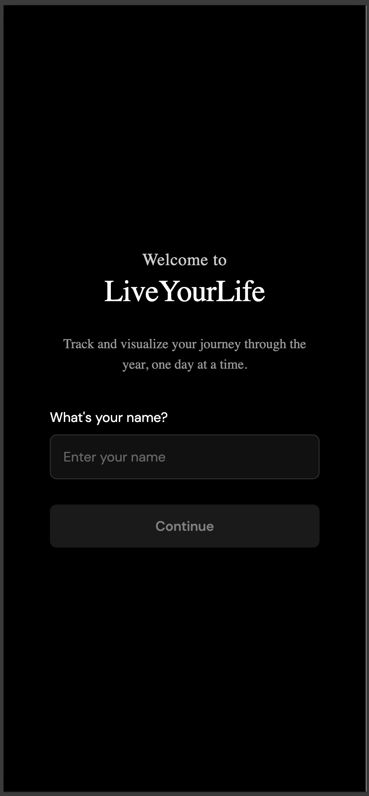
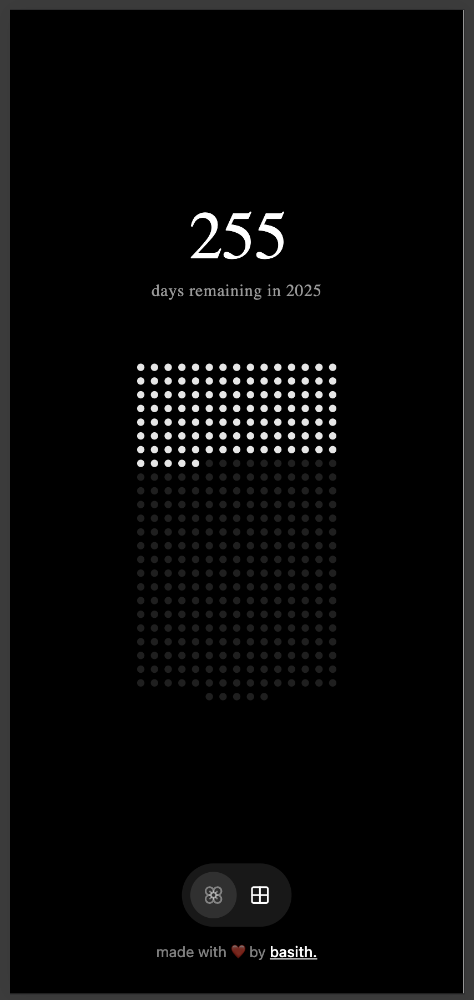

# LiveYourLife ⏳

LiveYourLife is a minimalist React Native Expo application designed to visually track the progression of days throughout the current year. It provides a simple yet elegant interface featuring a day counter and an interactive dot grid representing the 365 days of the year, helping users stay mindful of time's passage.

## ✨ Screenshot

<p align="center">
  
</p>
<br />
<p align="center">
  
</p>

## 🚀 Features

*   **Onboarding:** Simple flow to welcome new users and collect their name.
*   **Day Counter:** Displays the number of days passed in the current year, with an animated toggle to show remaining days.
*   **Dot Grid:** An interactive visual representation of all 365 days, highlighting passed days.
*   **Customization:** Settings to change user name and the accent color of the dot grid.
*   **Clean UI:** Dark-themed, minimalist design focusing on the core visualization.
*   **Navigation:** Tab-based navigation powered by Expo Router.
*   **Persistence:** User data and settings are saved locally using AsyncStorage.

## 🛠️ Tech Stack

*   **Framework:** React Native & Expo (SDK 52)
*   **Routing:** Expo Router (v4)
*   **Language:** TypeScript
*   **State Management:** React Context API
*   **Styling:** StyleSheet (with some inline styles)
*   **Icons:** Lucide React Native
*   **Fonts:** Google Fonts (DM Sans)
*   **Animations:** React Native Reanimated
*   **Storage:** AsyncStorage

## 📁 Project Structure

```
└── muhammedbasith-live-your-life/
    ├── app/              # Expo Router routes & layouts
    ├── assets/           # Static assets (images)
    ├── components/       # Reusable UI components
    ├── context/          # Global state management (AppContext)
    ├── hooks/            # Custom React hooks
    ├── .bolt/            # Bolt configuration (if used)
    ├── app.json          # Expo configuration
    ├── eas.json          # EAS Build/Submit configuration
    ├── package.json      # Project dependencies & scripts
    ├── tsconfig.json     # TypeScript configuration
    └── .prettierrc       # Code formatting rules
```

## 🏁 Getting Started

1.  **Clone the repository:**
    ```bash
    git clone <your-repo-url>
    cd muhammedbasith-live-your-life
    ```

2.  **Install dependencies:**
    ```bash
    npm install
    # or
    yarn install
    ```

3.  **Run the development server:**
    ```bash
    npm run dev
    # or
    yarn dev
    ```

4.  **Run on your device/simulator:**
    *   Scan the QR code using the Expo Go app on your Android or iOS device.
    *   Press `i` to run on an iOS simulator (requires Xcode).
    *   Press `a` to run on an Android emulator/device (requires Android Studio setup).
    *   Press `w` to run in a web browser.

---

Enjoy tracking your year! ✨
